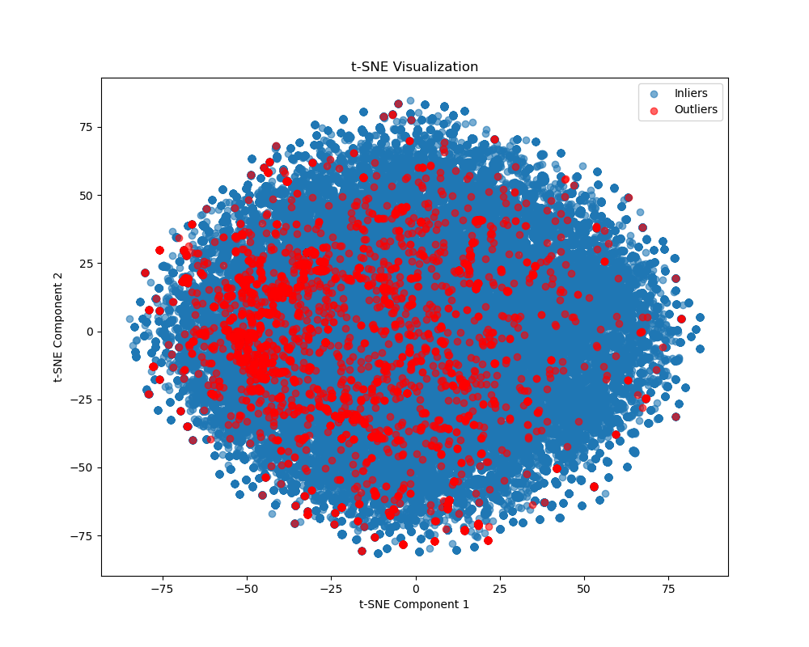

# Outlier Detection with Distribution Shift Scoring

<p align="center">
  
  
  
</p>

## Overview

This project implements an Outlier Detection pipeline combined with Distribution Shift Scoring using machine learning models to identify anomalies in the Amazon Reviews Dataset. The goal is to quantify the degree to which each sample deviates from the training distribution, enhancing insights into data drift and anomaly detection.

## Features

- **Multi-Model Outlier Detection**: Supports models like Isolation Forest, AutoEncoder, Variational AutoEncoder (VAE), and more.
- **Distribution Shift Scoring**: Quantifies how much each sample deviates from the training distribution.
- **t-SNE and UMAP Visualization**: Provides visualizations of the data and detected outliers.
- **Scalable and GPU-Accelerated**: Leverages TensorFlow, cuML, and PyTorch for GPU-accelerated training and scoring.

## Project Structure

```plaintext
├── outliers_detection.py         # Core detection class
├── requirements.txt              # Project dependencies
├── README.md                     # Project documentation
└── all_results/saved_models/     # Directory for saved models
```
## Installation
### Prerequisites
- Python 3.9+
- GPU Setup: NVIDIA GPU with CUDA support (for TensorFlow and cuML compatibility)
## Setup
### Clone the repository:

```
git clone https://github.com/yourusername/outlier-detection.git
cd outlier-detection
```
### Install dependencies:
```
pip install -r requirements.txt
```
### Ensure CUDA is set up for GPU-accelerated training.

## Usage
1. Initialize and Run Outlier Detection
Edit and run the outliers_detection.py file or import OutliersDetection as follows:

```
from outliers_detection import OutliersDetection
from pyod.models.iforest import IForest
from pyod.models.auto_encoder import AutoEncoder
from pyod.models.vae import VAE

# Define model configurations and datasets
models = {
    "Isolation Forest": IForest(contamination=0.1, random_state=42),
    "AutoEncoder": AutoEncoder(hidden_neuron_list=[64, 32], ...),
    "Variational AutoEncoder (VAE)": VAE(encoder_neuron_list=[128, 64, 32], ...)
}

sub_datasets = ["Health_and_Personal_Care", "All_Beauty", ...]

# Train and evaluate each model on each dataset
for sub_dataset in sub_datasets:
    for model_name, model_conf in models.items():
        detector = OutliersDetection(
            model_conf=model_conf,
            model_name=model_name,
            sub_dataset=sub_dataset,
            add_numerical_data=False,
            save_dir=f"results/{model_name}/{sub_dataset}"
        )
```

2. Distribution Shift Scoring
To analyze distribution shift, run:
```
detector.distribution_shift_scoring(detector.X_train, detector.X_test, save_dir="saved_plots", filename="distribution_shift.png")
```
3. Visualization
The following visualizations are available:

Outlier Score Distribution: Histogram of outlier scores for each model.
t-SNE: Visualizations to compare model outliers and distribution shift.

## Evaluation Metrics
Silhouette Score: Evaluates clustering separation for inliers and outliers.
Davies-Bouldin Index: Measures clustering validity; lower values indicate better separation.
Mean Distance to Nearest Neighbors: Highlights outliers based on k-nearest neighbor distance.
Results
Model performance and distribution shift scores are saved in the saved_models and saved_plots directories, including model evaluation metrics and score distributions you can dowload it from here.

## Example Visualizations
<p align="center">   </p>

## Notes
For large datasets, increase GPU memory or optimize model batch sizes to avoid memory issues.
Use --no-cache during Docker builds to ensure models and data updates reflect correctly.
Thit project was realized for a technical test for irly consulting group.
