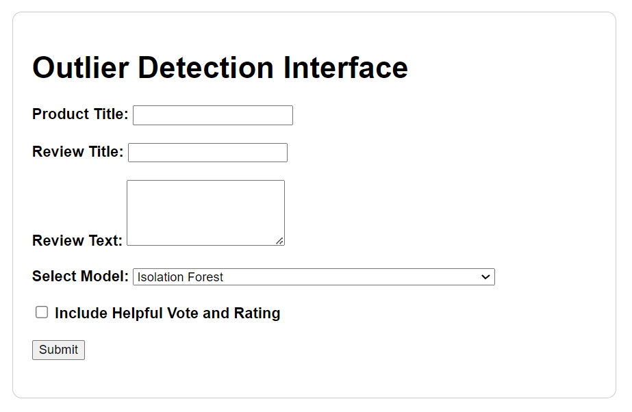
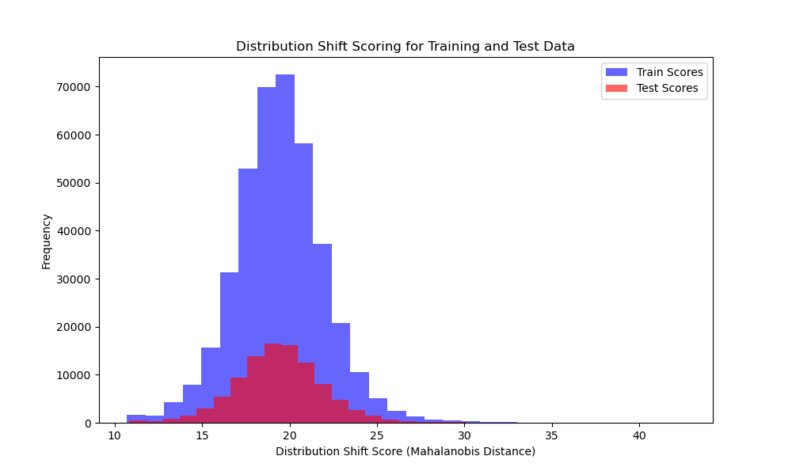
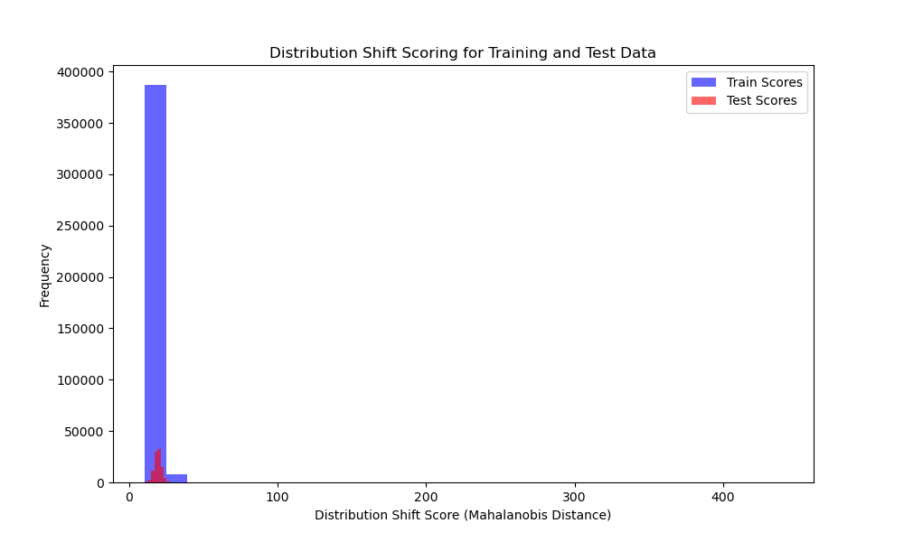

# Outliers Detection and Distribution Shift Scoring - Model Training Branch
## Prerequisites
<p align="center">
  
  
  
  
  
  
  
</p>

## Project Overview
The objective of this project is to identify anomalies and assess distribution shifts in [Amazon Reviews data 2023](https://huggingface.co/datasets/McAuley-Lab/Amazon-Reviews-2023). This branch provides the code for training models and setting up a real-time API for model predictions.

## Key Components
- Outlier Detection: Implements different models to identify outliers in the dataset.
- Distribution Shift Scoring: Provides a scoring mechanism to measure deviations from the training distribution.
- API: Built with FastAPI to serve the models for real-time predictions.
- Docker: The API is containerized for easier deployment and reproducibility.

## What does Outliers mean in our context?

To address the question of what constitutes an outlier in our context, I considered two types of training approaches:

- **Textual Data Training:** This approach focuses on the textual content, including the product title, review title, and review text. By analyzing these components, the model can identify reviews that seem off-topic or irrelevant to the product, potentially flagging them as outliers if they don’t align with typical patterns in the textual data.

- **Rating and Helpful Vote Training:** This second approach leverages numerical features, specifically the rating and the number of helpful votes. The rating provides an indication of the reviewer’s sentiment, while the helpful vote count may serve as a proxy for the review’s reliability or perceived usefulness. By analyzing these features, the model can identify reviews that are inconsistent (e.g., Negative review for a highly rated review or vice versa).


## Selected category
I chose to worked firstly on **Health_and_Personal_Care** category for the following reasons:
1. Data size:
"Health_and_Personal_Care" has approximately 461.7K users, 60.3K items, and 494.1K ratings, making it more manageable on my hardware (AMD Rayzen 7 and RTX-3090) compared to larger categories like "Home_and_Kitchen" or "Clothing_Shoes_and_Jewelry.
2. Size of textual data:
It includes 23.9M review tokens and 40.3M meta tokens, offering a rich amount of textual data without being overwhelming in size.
3. Interpretability:
This category is closely aligned with user safety and satisfaction.

I also worked on the **Magazine_subscriptions** dataset and the **Subscription_Boxes** dataset, because they're small and allowed me to implement the code initially. I also tried to analyze the results on these datasets later on.
## Experimentation
- According to [research](https://www.sensduclient.com/2021/06/25-chiffres-essentiels-sur-les-avis.html), the percentage of comments that appear unnatural on Amazon is estimated to be 9.1%. Based on this characteristic, I set the contamination criterion to 0.1 (10% of the dataset).
- For text data embedding, I used the model: all-MiniLM-L6-v2.

For this experimentation, I utilized several models suited for anomaly detection:

- **AutoEncoder:** A neural network model trained to reconstruct input data. Anomalies are identified based on reconstruction errors, with higher errors indicating potential outliers that deviate from typical patterns.
- **Variational AutoEncoder (VAE):** An extension of the AutoEncoder that introduces a probabilistic element, allowing the model to learn a latent space representation. The VAE is useful for capturing complex patterns and identifying outliers that do not fit within the learned distribution.
- **Isolation Forest:** An ensemble method that isolates data points by randomly partitioning the data space. Points that require fewer splits to be isolated are considered anomalies. It is effective for high-dimensional data and captures outliers based on their isolation.

## Repository Structure
The updated structure of this branch includes:

- **fast_api/:** Contains the FastAPI application code for serving outlier detection.
- **.gitignore:** Specifies files and folders to be ignored in version control.
- **README.md:** This file, providing an overview and instructions for the project.
- **outliers_detection.py:** Main script implementing outlier detection algorithms.
- **outliers_tester.py:** Script for testing and validating the trained models.
- **requirements.txt:** List of dependencies required to run the project.
- **train.ipynb:** Jupyter notebook for model training and experimentation.
- **tester.ipynb:** Jupyter notebook for testing the outlier detection models.
- **download_model.py:** Script to download the models.

## Setup Instructions
1. **Clone the Repository:**

```
git clone https://github.com/adel-taleb/Outliers_detection.git
cd Outliers_detection
git checkout model_training
```
2. **Install Dependencies:** Ensure you have Python 3.8 or later. Install dependencies from requirements.txt:

```
pip install -r requirements.txt
```
3. **download the models:**
```
python download_models.py
```
4. **Run the FastAPI Service:** Navigate to the fast_api folder and start the API using Docker:

```
cd fast_api
docker-compose up --build
docker-compose up
```
Open the web interface in your browser at http://localhost:8000/.

### Interface Features
<p align="center">   </p>

- **Product Title:** Enter the title of the product being reviewed.
- **Review Title:** Provide the title of the review.
- **Review Text:** Input the full text of the review for analysis.
- **Model Selection:** Choose an outlier detection model (Isolation Forest, AutoEncoder, GAN (VAE)) from the dropdown.
- **Include Helpful Vote and Rating:** Include helpful votes and rating information in the analysis when you choose a model trained on this additional features.

### Usage Instructions
1. Run the FastAPI server using Docker compose.
2. Open the web interface in your browser.
3. Fill in the form fields with the relevant review details.
3. Select the model you wish to use for outlier detection.
4. Click Submit to get the outlier detection result.
This interface makes it easy to test the API without needing to use curl commands or other API clients.

## Project Notes
This branch is dedicated to model training and API deployment. For a more comprehensive and scalable architecture with model tracking and cloud storage simulation, please refer to the prod_branch.
The code in this branch provides a straightforward, deployable solution for testing core functionalities of outlier detection and distribution shift scoring.

## Global Analysis of Results

| Model                        | Features Used                       | Silhouette Score | Davies-Bouldin Index | Mean Distance to 5 Nearest Neighbors |
|------------------------------|-------------------------------------|------------------|-----------------------|--------------------------------------|
| **AutoEncoder**              | Textual Data Only                  | 0.05            | 6.85                  | 0.33                                 |
| **Isolation Forest**         | Textual Data Only                  | 0.03            | 10.68                 | 0.33                                 |
| **Variational AutoEncoder**  | Textual Data Only                  | 0.06            | 6.46                  | 0.33                                 |
| **AutoEncoder**              | Textual Data + Ratings + Helpful Votes | 0.31            | 4.19                  | 0.39                                 |
| **Isolation Forest**         | Textual Data + Ratings + Helpful Votes | 0.06            | 8.89                  | 0.39                                 |
| **Variational AutoEncoder**  | Textual Data + Ratings + Helpful Votes | 0.33            | 3.87                  | 0.39                                 |

### Limited Interpretability of Outliers:
- The metrics, while showing some differences between models, suggest that the clustering and separation of outliers from inliers is not particularly strong across the board. For example, the Silhouette Scores are quite low even in the best cases (e.g., 0.33 for VAE with Ratings + Helpful Votes features), indicating weak cohesion within clusters and insufficient separation from other clusters.
- Similarly, the Davies-Bouldin Index, though improved with additional features, still reflects relatively high values, particularly for the Isolation Forest. A hihg Davies-Bouldin Index often implies that the clusters are not distinctly separated, meaning there is overlap between inliers and outliers in the feature space.
- The low Silhouette Scores (especially 0.03 for Isolation Forest with textual data only) suggest that the distinction between inliers and outliers is minimal. This implies that while the models identify some samples as outliers, they may not be capturing highly distinct or interpretable anomalies.
- The results on the Magazine_subscriptions dataset and the Subscription_Boxes dataset were very similar to the results on the Health_and_Personal_Care dataset.
### Impact of Additional Features
- Although the addition of useful ratings and votes improves measurements for all models, the degree of improvement is modest (for example, an increase in Silhouette score from 0.05 to 0.31 for AutoEncoder and 0.06 to 0.33 for VAE and a very small change for Isolation Forest). This shows that the models showing the greatest improvement tend to be deplearning-based models, and may therefore suggest that textual data alone is too complex, and that an avenue for improvement is to combine it with other data using deeper, more complex deplearning models. 
- If we consider this improvement to be significant, outliers can be considered by the models to be reviews with a contradictory rating (negative review and positive rating, or positive review and negative rating), and that the helpful_Vote feature can be used to validate the reliability of the comment.
-Of course, these results should be taken with **caution** given the rather low performance of our models.
### Shift scoring distribution 
The shift scoring distribution is similar between test data and train data for models trained on text data only is very low, both distribution for each of the models leave the same trend as shown in the figures.
<p align="center">
   <br>
   <b>Figure 1:</b> AutoEncoder (Textual data onmy)
</p>
<p align="center">
   <br>
   <b>Figure 2:</b> Variational AutoEncoder (Textual data onmy)
</p>
<p align="center">
   <br>
   <b>Figure 3:</b> Isolation Forest (Textual data onmy)
</p>For the data where we added ratings and helpfulvote data, the distribution is also similar but the data is very centered around 0, this may be due to the combination of text data and rating and helpful_vote data which are of two different nature and therefore in different dimensionality.
<p align="center">
   <br>
   <b>Figure 4:</b> AutoEncoder(Textual data + Ratings + Helpful Votes)
</p>
<p align="center">
   <br>
   <b>Figure 5:</b>  Variational AutoEncoder(Textual data + Ratings + Helpful Votes)
</p>
<p align="center">
   <br>
   <b>Figure 6:</b> Isolation Forest(Textual data + Ratings + Helpful Votes)
</p>
it's very difficult to come to any conclusions about the impact of shift with very low-performance models.

## Some improvement suggestions 
1. **Advanced Deep Learning Models.**
2. **Alternative Machine Learning Algorithms:** 
    1. One-Class SVM: Effective for detecting anomalies, but computationally expensive for large datasets.
    2. Local Outlier Factor (LOF): Good for identifying local anomalies in varying density structures, but memory-intensive.
3. **Experiment with Different Sub-Datasets**
4. **Hyperparameter Tuning:** Use techniques like Grid Search or Random Search to optimize model parameters during training, which can lead to better anomaly detection and more accurate distribution shift scoring.
5. **experiment with different embeddings:** Using alternatives like BERT.