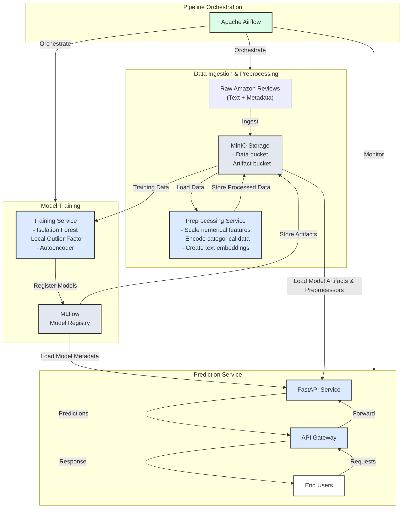

# Amazon Review Analysis System

A scalable machine learning system for analyzing Amazon reviews using anomaly detection techniques. The system processes raw review data, trains multiple models for outlier detection, and provides real-time predictions through a REST API.

## Architecture Overview





## System Components

### 1. Data Ingestion and Preprocessing
- Raw Amazon review data is stored in MinIO object storage
- Preprocessing service handles:
  - Numerical feature scaling
  - Categorical data encoding
  - Text embedding generation using SentenceTransformer
- Processed data is saved back to MinIO for training

### 2. Model Training
- Implements multiple anomaly detection models:
  - Isolation Forest
  - Local Outlier Factor
  - Autoencoder
- Models are tracked and versioned in MLflow
- Model artifacts are stored in MinIO's artifact bucket
- Training metrics and parameters are logged in MLflow

### 3. Prediction Service
- FastAPI-based REST API
- Loads latest model versions and preprocessors
- Provides real-time predictions
- Accessed through API Gateway for security and load balancing

### 4. Pipeline Orchestration
- Apache Airflow manages the end-to-end workflow
- Automates data processing, model training, and deployment
- Monitors service health and pipeline execution

## Prerequisites

- Docker
- Docker Compose
- Python 3.8+

## Project Structure

```
amazon-review-analysis/
├── docker-compose.yml
├── .env
├── AirflowDockerfile
│    └── Dockerfile
├── mlflowDockerfile
│    └── Dockerfile
├── Dockerfile
├── dags/
│   └── training_pipeline.py
│   └── [ML code modules]
│      └── preprocessing/
│      └── training/
├── airflow-data/
│   ├── logs/
│   ├── plugins/
│   └── airflow.cfg
├── mlruns/
│   └── [MLflow tracking data]
├── minio_data/
│   └── [MinIO storage data]
└── app/
    └── prediction/
```

## Service Configuration

The system uses Docker Compose to manage multiple services. Here's a breakdown of each service:

### Airflow Services
- **PostgreSQL Database**
  - Used by Airflow for metadata storage
  - Credentials: postgres/postgres
  - Port: 5432

- **Airflow Init**
  - Initializes the Airflow database
  - Creates default admin user
  - Credentials: airflow/airflow

- **Airflow Webserver**
  - Web interface for Airflow
  - Port: 8080
  - Access: http://localhost:8080

- **Airflow Scheduler**
  - Manages DAG scheduling and execution
  - Uses LocalExecutor for task execution

### MLflow Service
- Tracking server for ML experiments
- Port: 5050
- Access: http://localhost:5050
- Uses MinIO for artifact storage
- Environment variables:
  ```
  MLFLOW_TRACKING_URI=http://mlflow:5050
  MLFLOW_S3_ENDPOINT_URL=http://minio:9000
  AWS_ACCESS_KEY_ID=
  AWS_SECRET_ACCESS_KEY=
  ```

### MinIO Service
- Object storage for data and artifacts
- Ports: 
  - API: 9000
  - Console: 9001
- Access: 
  - API: http://localhost:9000
  - Console: http://localhost:9001
- Credentials:
  - Username: 
  - Password: 

### FastAPI Service
- Prediction API service
- Port: 3000
- Access: http://localhost:3000
- Connects to MLflow for model loading

## Setup Instructions

1. Clone the repository:
```bash
git clone <repository-url>
cd amazon-review-analysis
```

2. Create environment variables file:
```bash
cp .env.example .env
```

3. Build and start the services:
```bash
docker-compose up -d
```

4. Initialize MinIO buckets:
```bash
# Access MinIO console at http://localhost:9001
# Create required buckets:
# - mlartifactbucket (for MLflow artifacts)
# - datainput (for raw data)
# -(Created by airflow)
```

5. Access the services:
- Airflow UI: http://localhost:8080 (airflow/airflow)
- MLflow UI: http://localhost:5050
- MinIO Console: http://localhost:9001 (minio/minio123)
- FastAPI Swagger UI: http://localhost:3000/docs

## Environment Variables

Create a `.env` file with the following variables:

```env
# MinIO Configuration
MINIO_ROOT_USER=minio
MINIO_ROOT_PASSWORD=minio123

# MLflow Configuration
MLFLOW_TRACKING_URI=http://mlflow:5050
MLFLOW_S3_ENDPOINT_URL=http://minio:9000
AWS_ACCESS_KEY_ID=minio
AWS_SECRET_ACCESS_KEY=minio123

# Additional configurations as needed
```

## API Usage

Make predictions using the FastAPI endpoint:

```bash
curl -X POST "http://localhost:3000/predict" \
     -H "Content-Type: application/json" \
     -d '{
           "text": "Sample review text",
           "rating": 5,
           "verified_purchase": true
         }'
```

## Development

### Adding New DAGs
1. Place your DAG files in the `dags/` directory
2. They will be automatically picked up by Airflow

### Modifying Services
1. Update the respective Dockerfile
2. Rebuild the services:
```bash
docker-compose build <service_name>
docker-compose up -d <service_name>
```

## Monitoring

### Airflow Monitoring
- Access the Airflow UI to monitor DAG runs
- Check task logs and status
- View scheduler health

### MLflow Monitoring
- Track experiments and runs
- Compare model metrics
- Access model artifacts

### Container Health
```bash
# Check service status
docker-compose ps

# View logs
docker-compose logs -f [service_name]

# Monitor resources
docker stats
```

## Troubleshooting

Common issues and solutions:

1. **MLflow can't connect to MinIO**
   - Check if MinIO is healthy
   - Verify credentials in `.env`
   - Ensure buckets are created

2. **Airflow tasks failing**
   - Check task logs in Airflow UI
   - Verify DAG configuration
   - Check volume permissions

3. **FastAPI service not loading models**
   - Verify MLflow connection
   - Check model registration in MLflow
   - Validate model artifacts in MinIO

## Contributing

1. Fork the repository
2. Create a feature branch
3. Commit your changes
4. Push to the branch
5. Create a Pull Request

## License

[Add your license information here]

## Contact

[Add your contact information here]
